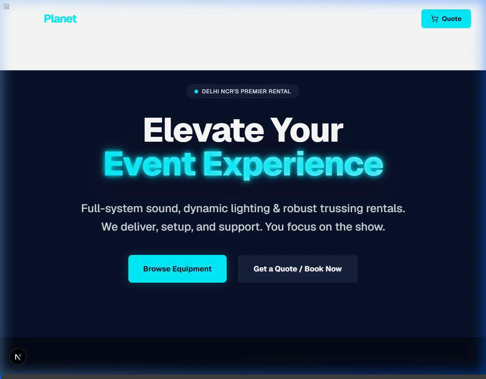

# Audioplanet Web

Audioplanet is a premium audio, lighting, and truss rental service for live events based in Delhi NCR.

**Live URL**: [https://audio-planet.vercel.app/](https://audio-planet.vercel.app/)

## 🚀 About The Website

The Audioplanet website is designed to provide customers with an intuitive and seamless experience for browsing rental inventory and booking equipment for their live events.



### Key Functionalities

- **Inventory Browsing**: Users can explore a comprehensive catalog of premium audio gear, stage lighting, and truss structures.
- **Quote & Booking System**: Customers can request custom quotes and book equipment for their specific event dates. The system handles pricing logic including delivery fees, setup fees, and staffing (engineers).
- **Admin Dashboard**: A dedicated secure area for staff to manage bookings, inventory, and users.
- **Interactive 3D Elements**: Uses Three.js to provide interactive and engaging 3D visuals of equipment or stage setups.
- **Location & Logistics**: Integrated Mapbox for precise delivery locations and calculating logistics costs within the Delhi NCR region.
- **Authentication**: Secure login system for administrators and potentially customers to manage their bookings.

## 🛠️ Technology Stack

The project is built using modern web technologies to ensure a fast, responsive, and maintainable application:

- **Framework**: [Next.js 16](https://nextjs.org/) (App Router)
- **Frontend Library**: [React 19](https://react.dev/)
- **Styling**: [Tailwind CSS v4](https://tailwindcss.com/)
- **State Management**: [Zustand](https://zustand-demo.pmnd.rs/)
- **Database ORM**: [Prisma](https://www.prisma.io/)
- **3D Graphics**: [Three.js](https://threejs.org/) & [@react-three/fiber](https://docs.pmnd.rs/react-three-fiber/getting-started/introduction)
- **Maps**: [@mapbox/search-js-react](https://docs.mapbox.com/)
- **Icons**: [Lucide React](https://lucide.dev/)

## 📦 Getting Started

First, install the dependencies:

```bash
npm install
```

Then, run the development server:

```bash
npm run dev
```

Open [http://localhost:3000](http://localhost:3000) with your browser to see the result.

## 📞 Contact Information

- **Phone**: +91 99999 99999
- **Support**: support@audioplanet.in
- **Sales/Bookings**: bookings@audioplanet.in
- **Warehouse**: Plot 14, Sector 63, Noida, Uttar Pradesh, India
